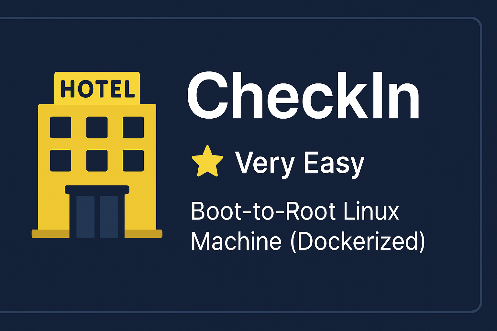

<p align="center">
  
</p>

# 🏨 CheckIn

**Difficulty:** ⭐ Very Easy  
**Type:** Boot-to-Root Linux Machine (Dockerized)  
**Category:** CTF / Ethical Hacking Practice

---

## 📖 Overview
Welcome to **CheckIn** — a beginner-friendly Linux CTF challenge that takes place in a hotel-themed environment.  
Your mission is simple: explore, investigate, and work your way to **root**.  

This machine is fully containerized using Docker, so you can run it locally in just a few steps.  
Perfect for those getting started with web and privilege escalation challenges.

---

## 🚀 Quick Start

### 1️⃣ Clone the Repository
```
git clone https://github.com/YOUR_USERNAME/checkin.git
cd checkin
```

### 2️⃣ Build the Docker Image
```
docker build -t checkin .
```

### 3️⃣ Run the Challenge
```
docker run -d --name checkin -p 8080:80 checkin
```

### 4️⃣ Access the Challenge

Visit:
http://localhost:8080

### 🎯 Goal

Identifying different web application vulnerabilities.

Gain initial access to the machine by stealing credentials through the identified web application vulnerabilities.

Escalate privileges to root.

Capture both user flag and root flag.

### 🛠 Requirements

Docker installed on your system.

### 📜 License

This project is an exclusive intellectual property of its owner.  
Unauthorized copying, modification, redistribution, or publication is strictly prohibited.  
For permissions, please contact the repository owner.

Happy Hacking! 🕵️‍♂️💻


